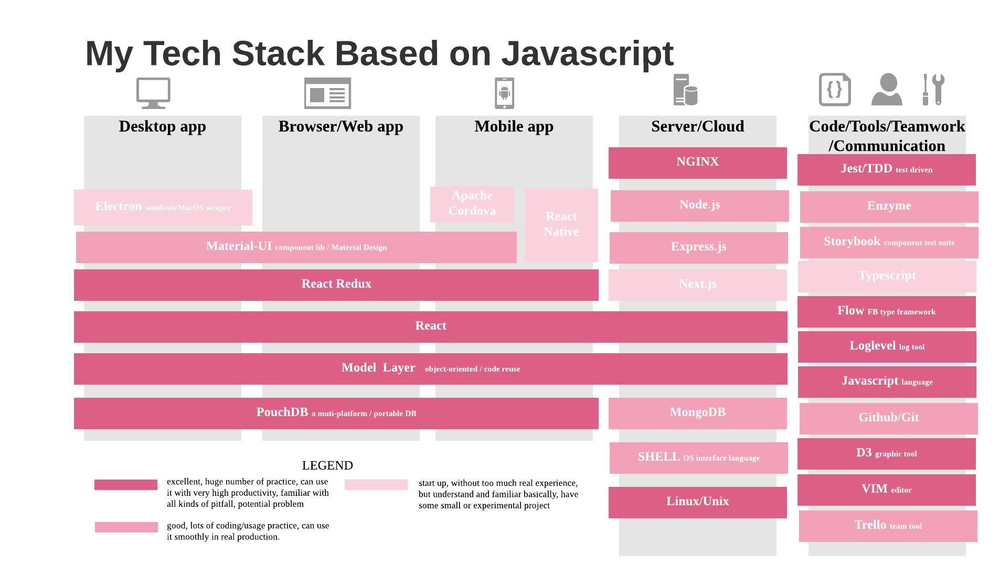
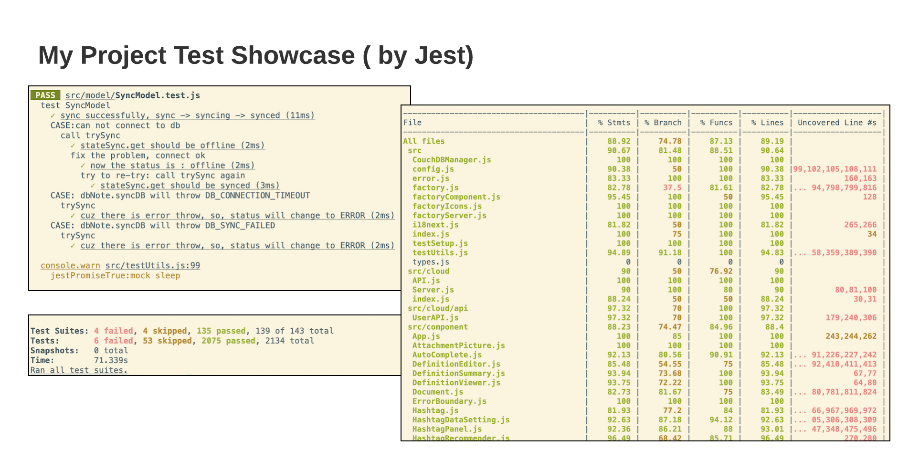
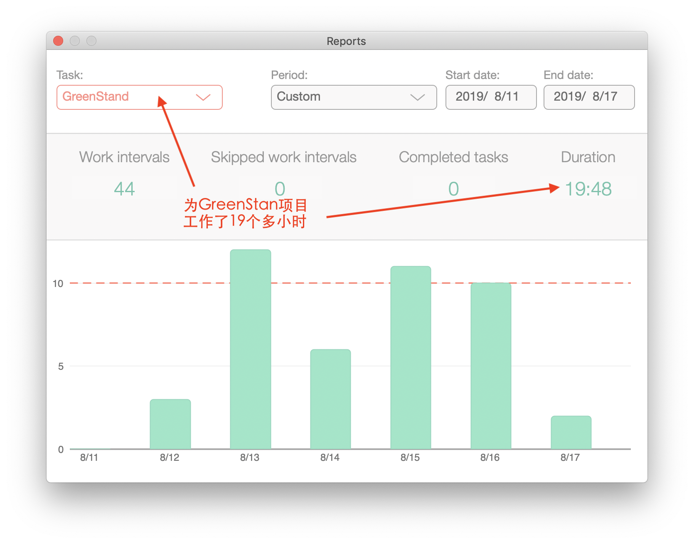
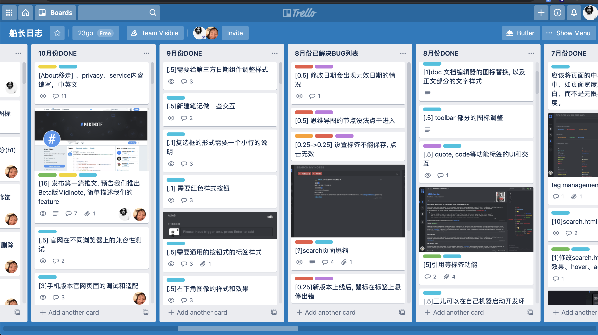

# some code sample

## list of sample files ##

* [Navigator.js](./Navigator.js) 

 This is a model of navigator function, it is about controlling a back/forth button to switch between documents. Just like the backword/forward buttons on any Browser.
 
* [Navigator.test.js](./Navigator.test.js)

 To test the model of Navigator. The most complicated part of this model is that we need to cover every possible case when  user clicks.

* [NavigatorComponent.js](./NavigatorComponent.js)

The component to show this Navigator. I am using Redux, but furthermore, I build a model injection framework by my self, to decouple the models and components. Just like what Spring Framework does in Java world.

* [NavigatorComponent.test.js](./NavigatorComponent.test.js)

To test the component of the navigator, because I have tested the logic of the model, so here just test if it invokes the model correctly.

* [HashtagModel.js](./HashtagModel.js) [HashtagModel.test.js](./HashtagModel.test.js)

A complicated model and test.

* [summerConnect.js](./summerConnect.js)

A customized React-Redux connect module written by myself, I use it to inject models to components, to decouple model and view. 

* [hashtagStories.js](./hashtagStories.js)

Test case for 'hashtag' component, I use Storybook to design/develop/test components. 

* [UserModel.js](./UserModel.js)

My model on the server-side, also used my model injection framework to compose the modules,  by doing so, it brings an Isomorphic System on front and back.

# My Tech Stack Based on Javascript

# A Test Report (by Jest)

# Time-Management

I use Pomodoro Tech for time management, this is a screenshot of my pomodoro report.

# Teamwork 

I use Trello and Slack for team communication and coordination, here is a screenshot.

